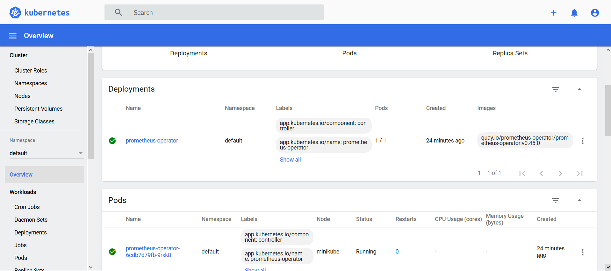

@ ## Установка minikubes

> Инструкция: https://kubernetes.io/ru/docs/setup/learning-environment/minikube/#%D1%83%D0%BA%D0%B0%D0%B7%D0%B0%D0%BD%D0%B8%D0%B5-%D0%B4%D1%80%D0%B0%D0%B9%D0%B2%D0%B5%D1%80%D0%B0-%D0%B2%D0%B8%D1%80%D1%82%D1%83%D0%B0%D0%BB%D1%8C%D0%BD%D0%BE%D0%B9-%D0%BC%D0%B0%D1%88%D0%B8%D0%BD%D1%8B
1. Скачать minikubes по ссылке https://github.com/kubernetes/minikube/releases/latest/download/minikube-installer.exe
2. Установить: minikube start --vm-driver=docker
3. Проверка установки

    `minikube status`

## Создать namespace
@ kubectl create namespace monitoring

## Установить Helm

Инструкция по установке Helm:  
https://github.com/helm/helm/releases/latest

## Установка Prometheus

Создать папку ..\2020-12-otus-software-architect-lyulin\hw03-Prometheus\prometheus 
Выполнить команду
`git clone https://github.com/coreos/prometheus-operator`
Перейти в папку .\2020-12-otus-software-architect-lyulin\hw03-Prometheus\prometheus\prometheus-operator\ 
Выполнить установку prometheus командой:
`kubectl apply -f bundle.yaml`
Проверить установку командой:
`kubectl get po`


## Установка Web UI (Dashboard)
Инструкция: https://kubernetes.io/docs/tasks/access-application-cluster/web-ui-dashboard/
Установка:
kubectl apply -f https://raw.githubusercontent.com/kubernetes/dashboard/v2.0.0/aio/deploy/recommended.yaml
Создание пользователя:
Инструкция: https://github.com/kubernetes/dashboard/blob/master/docs/user/access-control/creating-sample-user.md

Creating a Service Account
kubectl apply -f ./kubernates-dashboard/ServiceAccount.yaml

Creating a ClusterRoleBinding
kubectl apply -f ./kubernates-dashboard/ClusterRoleBinding.yaml

Getting a Bearer Token
kubectl -n kubernetes-dashboard get secret $(kubectl -n kubernetes-dashboard get sa/admin-user -o jsonpath="{.secrets[0].name}") -o go-template="{{.data.token | base64decode}}" > ./kubernates-dashboard/token

Для доступа к Dashboard
kubectl proxy

Заходим через броузер
http://localhost:8001/api/v1/namespaces/kubernetes-dashboard/services/https:kubernetes-dashboard:/proxy/
и в поле Token вводим полученный токен.

Accessing the Dashboard UI
http://localhost:8001/api/v1/namespaces/kubernetes-dashboard/services/https:kubernetes-dashboard:/proxy/

Заходим в dashboard и видим prometheus-operator
	

Для удаления:
kubectl -n kubernetes-dashboard delete serviceaccount admin-user
kubectl -n kubernetes-dashboard delete clusterrolebinding admin-user

-------------------

Это не надо

### Добавить репозиторий c helm chart Prometheus
Инструкция на: https://github.com/prometheus-community/helm-charts

`helm repo add prometheus-community https://prometheus-community.github.io/helm-charts`

### Добавить helm репозитории
Перейти в папку \2020-12-otus-software-architect-lyulin\hw03-Prometheus\prometheus\ 
Выполнить команду
`helm repo add prometheus-community`

`helm repo add stable https://charts.helm.sh/stable`

`helm repo update`

helm create hw03-Prometheus

https://technology.amis.nl/devops/first-steps-with-prometheus-and-grafana-on-kubernetes-on-windows/

--------
Отсюда начинается:

Установка всего и вся

## Разместить образ в DockerHub https://hub.docker.com/

```
docker images
docker tag <Image ID для hw1-health-app> vlyulin/hw03-library-app:latest
docker login
docker push vlyulin/hw03-library-app
```
В DockerHub появится репозиторий vlyulin/hw02-library-app

## Добавление Ingress
`minikube addons enable ingress`
Проверить установку ingress командой:  
`kubectl get pods -A | grep ingress`

## Установка Helm
Источник:
https://github.com/helm/helm/releases/tag/v3.5.2
Создать и выполнить скрипт установки:
https://raw.githubusercontent.com/helm/helm/master/scripts/get-helm-3

### Добавить репозиторий bitnami, где хранятся официальные charts
`helm repo add bitnami https://charts.bitnami.com/bitnami`

#Установить приложение hw03-library-app
Перейти в директорию 2020-12-otus-software-architect-lyulin\hw03-Kubernetes\kubernetes\hw03-library-app
выполнить команды
```
kubectl create namespace hw03
helm install --namespace=hw03 hw03-library-app ./hw03-library-app
--replace
или выполнить скрипт
install-hw03-library-app.sh
```

Если ругается на postgresql-10.0.0.tgz, то удалить архив и выполнить следующие действия:
перейти в директорию 2020-12-otus-software-architect-lyulin\hw03-Kubernetes\kubernetes\hw03-library-app
выполнить команду:
```
helm dependency update hw03-library-app/
```

Проверить установку:
```
kubectl get po -n hw03
```
Посмотреть логи:
```
kubectl -n hw03 logs pod/<имя пода>
```

Посмотреть созданные ресурсы внутри куба:
```
kubectl get all -l app.kubernetes.io/instance=hw03-library-app -n hw03
helm list -n hw03 | grep hw03-library-app
```
Проверить формат метрик:
Для PowerShell
Invoke-RestMethod -Uri http://arch.homework/prometheus
https://docs.microsoft.com/en-us/powershell/module/Microsoft.powershell.utility/invoke-restmethod?view=powershell-7.1

# Настройка мониторинга в Prometheus
Создаем файл ServiceMonitor в директории
.\2020-12-otus-software-architect-lyulin\hw03-Prometheus\kubernates\hw03-library-app\templates\servicemonitor.yaml 

endpoint должен быть таким:
endpoints:
  - interval: 5s
    port: http
    path: hw03-Prometheus-3.0.0/prometheus

Пишут, что можно так:
kubectl create -f ./servicemonitor.yaml

Добавляем следующий текст в файл values.yaml 
metrics:
  serviceMonitor:
    enabled: true

Апгрейдим релиз
`helm upgrade hw03-library-app ./hw03-library-app -n hw03 --atomic`
где --atomic - if set, upgrade process rolls back changes made in case of failed upgrade. The --wait flag will be set automatically if --atomic is used
Это из документации https://helm.sh/docs/helm/helm_upgrade/

Смотрим, что сервис-монитор создался
kubectl get servicemonitors.monitoring.coreos.com -n monitoring

Смотрим что внутри
kubectl describe servicemonitors.monitoring.coreos.com hw03-library-app -n hw03

Проверяем мониторит ли Prometheus сервис пользуясь советом:
kubectl get -n monitoring prometheus -o yaml
где monitoring это неймспейс куда установлен прометеус.
Выдаст конфиг, смотришь serviceMonitorSelector.matchLabels: тут будут лейблы по которым должны твои ServiceMonitor селектится

В файле .\2020-12-otus-software-architect-lyulin\hw03-Prometheus\kubernates\hw03-library-app\templates\servicemonitor.yaml
Поменял 
metadata:
  name: hw03-library-app
на
metadata:
  name: prom

Посмотреть на servicemonitor
kubectl describe servicemonitor -n hw03

Перегрузить Prometheus
curl -X POST http://localhost:9090/-/reload
Invoke-WebRequest -Uri http://localhost:9090/-/reload -Method 'POST'

======
Создал 
.\2020-12-otus-software-architect-lyulin\hw03-Prometheus\kubernates\servicemonitor2.yaml 
Установка в namespace monitoring:
kubectl apply -f servicemonitor2.yaml -n monitoring

По материалу: https://kruschecompany.com/kubernetes-prometheus-operator/
-------
Проверил, to see what metrics are going to be needed to run the command:
kubectl get servicemonitors.monitoring.coreos.com -n monitoring
-------
Now deployServiceMonitors. Prometheus discovers ServiceMonitors by label. You need to know which ServiceMonitors label it is looking for. To do this:
kubectl get prometheuses.monitoring.coreos.com -oyaml

## Удаление релиза
#### Get all releases
```
helm ls --all-namespaces  
OR
helm ls -A
```

#### Delete release
```
helm uninstall release_name -n release_namespace
helm uninstall hw03-library-app -n hw03
```


------
Полезные ссылки
https://github.com/mkjelland/spring-boot-postgres-on-k8s-sample

------

Добавить в приложение метрики Prometheus

Пробуем это:
https://njalnordmark.wordpress.com/2017/05/08/using-prometheus-with-spring-boot/
Это заработало!


------
Вслучае с Docker Desktop и встроенным Kubernates
 
Проверяем ingress
kubectl describe ing hw03-library-app -n hw03

Видим, что поле Address: пустое
Name:             hw03-library-app
Namespace:        hw03
Address:
Default backend:  default-http-backend:80 (<none>)

Причина, не установлен nginx-ingress

Установка nginx-ingress
https://kubernetes.github.io/ingress-nginx/deploy/#using-helm
helm repo add ingress-nginx https://kubernetes.github.io/ingress-nginx
helm repo update
helm install ingress-nginx ingress-nginx/ingress-nginx

Проверка после установки:
kubectl describe ing hw03-library-app -n hw03

Name:             hw03-library-app
Namespace:        hw03
Address:          localhost
Default backend:  default-http-backend:80 (<none>)

Адресс появился.

-------
Зайти в pod
kubectl exec hw03-library-app-65c7dbbfdc-95288 -n hw03 -ti -- bash

-------

# Установка prometheus
# Источник: https://github.com/prometheus-community/helm-charts/tree/main/charts/kube-prometheus-stack

# helm repo add prometheus-community https://prometheus-community.github.io/helm-charts
# helm repo add stable https://charts.helm.sh/stable
# helm repo update

Посмотреть версии prometheus-community:
helm search repo prometheus-community/kube-prometheus-stack --versions

Установить prometheus:
# helm install 13.11.0 prometheus-community/kube-prometheus-stack
# Можно установить в --namespace monitoring
# 13.10.0
# helm install 13.10.0 prometheus-community/kube-prometheus-stack

kubectl create namespace monitoring
kubectl config set-context --current --namespace=monitoring

helm repo add prometheus-community https://prometheus-community.github.io/helm-charts
helm repo add stable https://charts.helm.sh/stable
helm repo update

helm install prom prometheus-community/kube-prometheus-stack 
можно иначе 
helm install prometheus-community/kube-prometheus-stack --generate-name

kube-prometheus-stack has been installed. Check its status by running:
  kubectl --namespace monitoring get pods -l "release=prom"

Посмотреть pods
kubectl --namespace monitoring get pods

Доступ к Graphana
kubectl port-forward -n monitoring service/prom-grafana 9000:80
http://localhost:9000/dashboard/new?orgId=1
admin/... где-то в слаке или в google-doke

Доступ к Prometheus:
kubectl port-forward -n monitoring service/prom-kube-prometheus-stack-prometheus 9090

-------------
Установка ab под Windows для нагрузочного тестирования
https://www.cedric-dumont.com/2017/02/01/install-apache-benchmarking-tool-ab-on-windows/

while 1; do c:\Utils\ab -n 50 -c 5 http://arch.homework/users ; sleep 3; done

while(true){
    c:\Utils\ab -n 50 -c 5 http://arch.homework/users
    sleep 3
}


### Ingress and Graphana
#### Метрики с Ingress-ов

Для того, что nginx начал отдавать метрики, необходимо ему это прописать в настройках.
Для этого создается файл nginx-ingress.yaml

Где указано metrics.serviceMonitor.enabled=true
Еще добавил
```
  metadata:
      name: prom-daemonset
      # hw03-library-app
      labels:
        release: prom
```

Теперь обновим релиз nginx-ingress через helm
helm list
смотрим name для ingress. В моем случае ingress-nginx
указываем это имя в качестве [RELEASE] в команде helm upgrade
`helm upgrade ingress-nginx ingress-nginx/ingress-nginx -f nginx-ingress.yaml`

Смотрим, что сервис монитор добавился
kubectl get servicemonitors.monitoring.coreos.com -n hw03
Появился:
NAME                                        AGE
hw03-library-app-ingress-nginx-controller   10m

Если ошибка при повторной инсталяции
Error: Internal error occurred: failed calling webhook "validate.nginx.ingress.kubernetes.io": Post "https://ingress-nginx-prom-daemonset-admission.default.
svc:443/networking/v1beta1/ingresses?timeout=10s": dial tcp 10.99.184.10:443: connect: connection refused

kubectl get daemonsets -n hw03
kubectl delete daemonsets/hw03-library-app-ingress-nginx-controller -n hw03

Error: failed to create resource: Internal error occurred: failed calling webhook "validate.nginx.ingress.kubernetes.io": Post "https://ingress-nginx-prom-d
aemonset-admission.default.svc:443/networking/v1beta1/ingresses?timeout=10s": dial tcp 10.99.184.10:443: connect: connection refused

kubectl get validatingwebhookconfiguration
kubectl delete validatingwebhookconfigurations ingress-nginx-admission

После этого установилось.
Восстановление ingress
helm upgrade ingress-nginx ingress-nginx/ingress-nginx

Какая-то беда с nginx
helm delete ingress-nginx

Error: failed to create resource: Internal error occurred: failed calling webhook "validate.nginx.ingress.kubernetes.io"

kubectl get validatingwebhookconfigurations 
kubectl delete validatingwebhookconfigurations [configuration-name]
kubectl delete validatingwebhookconfigurations ingress-nginx-admission

------

https://www.digitalocean.com/community/questions/trouble-monitoring-nginx-ingress-with-prometheus
Вот это заработало. 
Включил сбор метрик и убрал ограничение на namespace:
моё
# upgrade ingress to enable metrics
helm upgrade ingress-nginx ingress-nginx/ingress-nginx --namespace default --set controller.metrics.serviceMonitor.enabled=true --set controller.metrics.enabled=true

# upgrade prometheus operator to look in other namespaces
helm upgrade prometheus-operator stable/prometheus-operator --namespace monitoring --set prometheus.prometheusSpec.serviceMonitorSelectorNilUsesHelmValues=false

kubectl get servicemonitors.monitoring.coreos.com
----
helm list -n hw03
helm upgrade hw03-library-app ingress-nginx/ingress-nginx --namespace hw03 --set controller.metrics.serviceMonitor.enabled=true --set controller.metrics.enabled=true

-------------
Graphana

RPC for nginx-ingress
rate(nginx_ingress_controller_request_duration_seconds_count{host="arch.homework"}[1m])

RPC for hw03-library-app
rate(http_server_requests_seconds_count[1m])

200 counter for nginx-ingress
sum by (status) (increase(nginx_ingress_controller_request_duration_seconds_count{status=~"2.+"}[1m]))

200 counter for hw03-library-app
sum by (status) (increase(http_server_requests_seconds_count{status=~"2.+"}[1m]))

-------------
Полезности:
https://nickjanetakis.com/blog/a-linux-dev-environment-on-windows-with-wsl-2-docker-desktop-and-more

Invoke-WebRequest
https://docs.microsoft.com/en-us/powershell/module/microsoft.powershell.utility/invoke-webrequest?view=powershell-7.1
