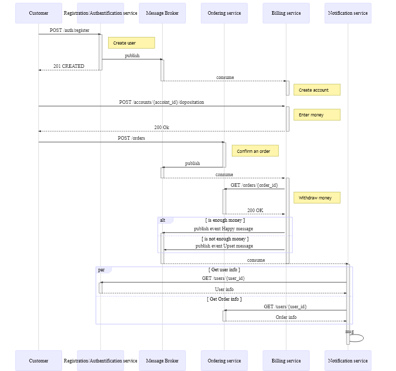
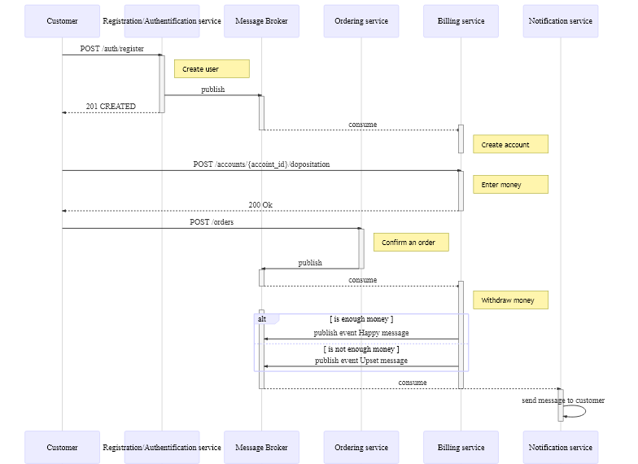

## Сценарий:

- Пользователь регистрируется в Системе;
- При регистрации пользователя создается account в сервисе биллинга;
- Пользователь вносит деньги на свой account в сервисе биллинга;
- Пользователь подтверждает заказ в сервисе заказов (шаги создания корзины и её наполнения в данный сценарий не входит); 
- При размещении заказа происходит снятие денег в сервисе биллинга;
- Если биллинг подтверждает платеж, то через сервис нотификаций пользователю отправляется подтверждение об успешном размещении заказа;
- Если биллинг НЕ подтверждает платеж, то через сервис нотификаций пользователь информируется об ошибке;

## RESTful

[Authentification Service описание REST интерфейсов](https://app.swaggerhub.com/apis-docs/vlyulin4/registration-authentification_service_api/1.0)  
[Billing Service описание REST интерфейсов](https://app.swaggerhub.com/apis-docs/vlyulin4/billing-service_api/1.0)  
[Order Service описание REST интерфейсов](https://app.swaggerhub.com/apis-docs/vlyulin4/order-service_api/1.0)  
[Notification Service описание REST интерфейсов](https://app.swaggerhub.com/apis-docs/vlyulin4/notification-service_api/1.0)  

Модель взаимодействия синхронная, что упрощает её понимание.
Оркестратора сервисов как такового нет, поэтому схема обладает довольно высокой связанностью по управлению (control coupling).

## Event notification

Принцип взаимодействия "Event notification" заключается в том, что при изменении какого-либо объекта публикуется соответствующее сообщение о его изменении.
Заинтересованный сервис, подписанные на такие извещения, при получении сообщения обращается к сервису источнику сообщения для получения нового состояния.
Обращение за новым состоянием выполняется по синхронному протоколу REST.

## Event collaboration

Принцип взаимодействия "Event collaboration" заключается в том, что при изменении какого-либо объекта публикуется соответствующее сообщение о его изменении с полным описанием текущего измененного состояния.
Заинтересованный сервис, подписанные на такие извещения, при получении сообщения обновляет состоние своих данных в соответствии с полученным состоянием.
"Потребляется" только необходимая информация из полученного сообщения.
Таким образом, дополнительных обращений в другие сервисы не выполняется, что уменьшает нагрузку на чтение для других сервисов.

