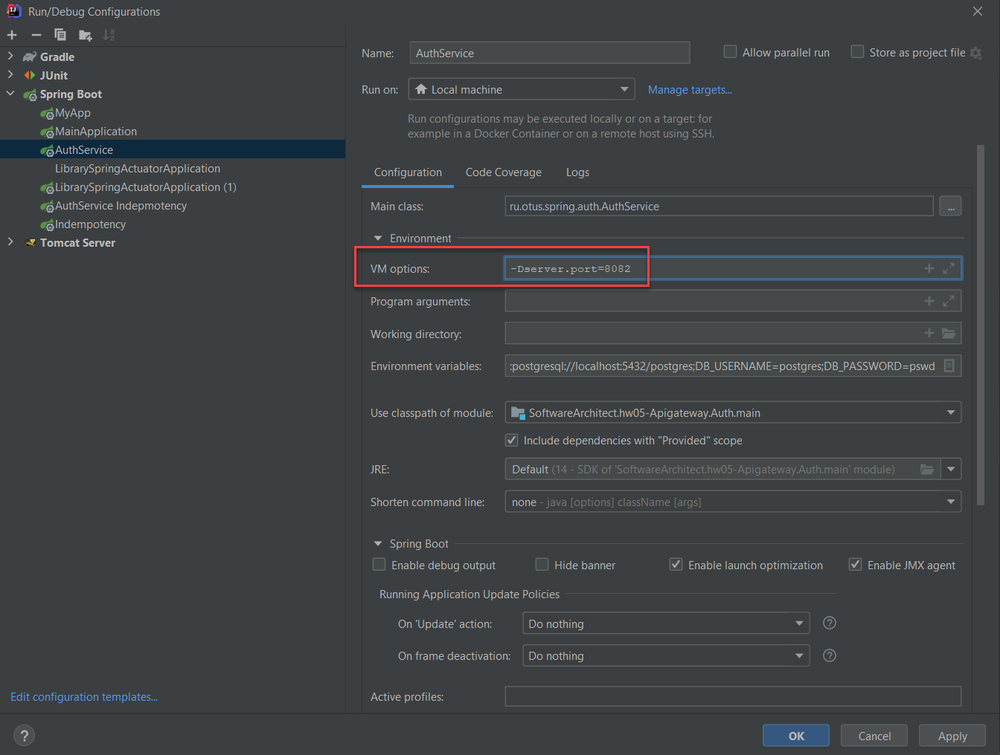
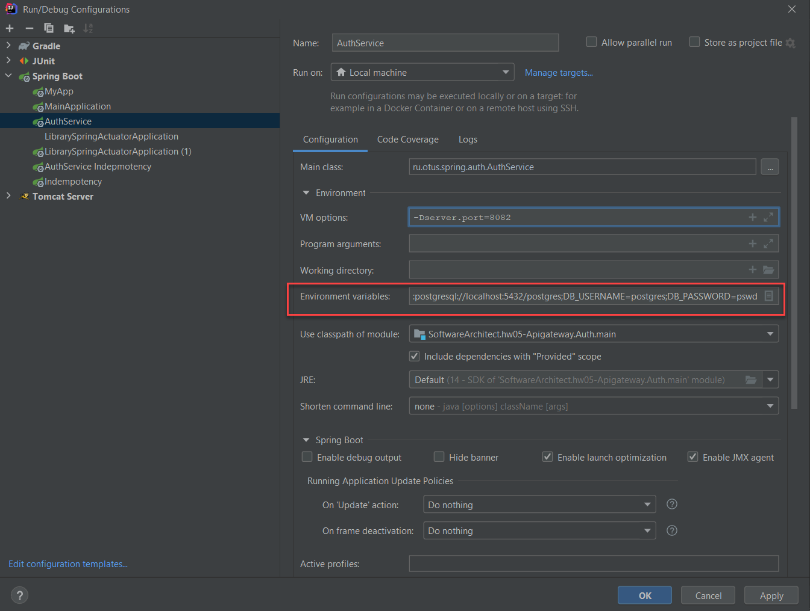

# Шаги:

## Отладка
Для запуска Auth сервиса на другом порту надо указать требуемый порт в VM Options в профиле запуска.  
Например:  
```
-Dserver.port=8082
```


Для соединения с базой данной в режиме отладки надо установить переменные окружения в поле "Environment Variables":  
```
DB_DRIVER=org.postgresql.Driver;DB_URL=jdbc:postgresql://localhost:5432/postgres;DB_USERNAME=postgres;DB_PASSWORD=pswd
```



## Собрать приложение
Из директории проекта 2020-12-otus-software-architect-lyulin
выполнить команду: 

```
gradlew :hw08-Idempotency:Auth:build
или
gradle :hw08-Idempotency:Auth:build
```

Проверить запуск приложения
```
java -DDB_DRIVER=org.postgresql.Driver -DDB_URL=jdbc:postgresql://localhost:5432/postgres -DDB_USERNAME=postgresadmin -DDB_PASSWORD=pswd -jar ./hw08-Idempotency/Auth/build/libs/Auth-1.0.0.jar
```

## Собрать docker-файла с приложением

Из директории проекта 2020-12-otus-software-architect-lyulin выполнить команду:  
```
docker build -f ./hw08-Idempotency/Auth/Dockerfile.hw08-Idempotency-auth --build-arg JAR_FILE=./hw08-Idempotency/Auth/build/libs/*.jar -t vlyulin/hw08-idempotency-auth .
```  
***None***: -t vlyulin/hw08-Idempotency-auth сразу установит tag  

### Проверить запуск приложения из docker
```
docker run -p 8080:8080 -t vlyulin/hw08-idempotency-auth
```
## Разместить образ в DockerHub
https://hub.docker.com/

```
docker images
docker login
docker push vlyulin/hw08-idempotency-auth
```

## Создать Helm chart для приложения hw02-library-app
mkdir .\hw08-Idempotency\Auth\kubernates\
cd .\hw08-Idempotency\Auth\kubernates\
helm create hw08-Idempotency-auth

### Внести изменения в helm templates
- .\hw08-Idempotency\Auth\kubernates\hw08-Idempotency-auth\values.yaml  
- .\hw08-Idempotency\Auth\kubernates\hw08-Idempotency-auth\templates\config.yaml  
- .\hw08-Idempotency-auth\templates\deployment.yaml  
- .\hw08-Idempotency\Auth\kubernates\hw08-Idempotency-auth\templates\_helpers.tpl  
Добавлено:  
```
{{- define "postgresql.fullname" -}}
{{- printf "%s-%s" .Release.Name "postgresql" | trunc 63 -}}
{{- end -}}
```

### Проверить генерацию templates
```
helm install hw08-idempotency-auth .\hw08-Idempotency\Auth\kubernates\hw08-idempotency-auth --dry-run
```
## Удалить предыдущую установку 
```
helm uninstall hw08-idempotency-auth
```

## Установить приложение
```
helm install --replace hw08-idempotency-auth .\hw08-Idempotency\Auth\kubernates\hw08-idempotency-auth
```

## Разное 
### Определение доменного имени сервиса
***На основе***: https://medium.com/kubernetes-tutorials/kubernetes-dns-for-services-and-pods-664804211501
kubectl exec -it hw08-Idempotency-auth-6b5f58fb87-jtrct -- sh
PING hw08-Idempotency-auth.default.svc.cluster.local (10.97.121.80): 56 data bytes

***Note***
Как выполнять debug контейнера
https://kubernetes.io/docs/tasks/debug-application-cluster/debug-running-pod/
