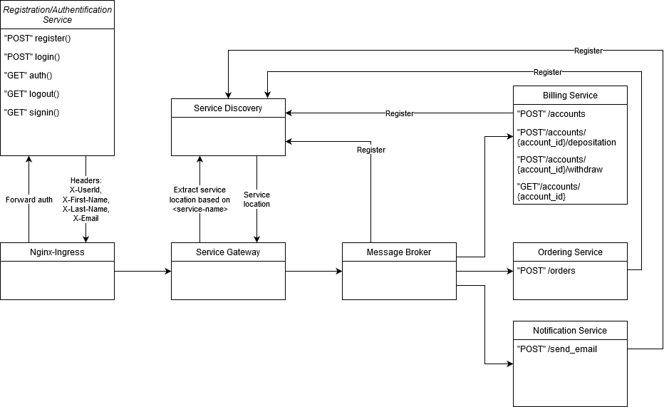
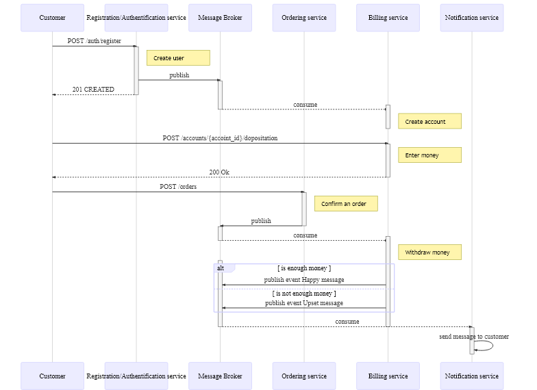

## Сценарии использования:

### UC01. Пользователь регистрируется в Системе;

<table>
  <tr>
    <td><b>Краткое описание</b></td>
    <td>Регистрация пользователя</td>
  </tr>
  <tr>
    <td><b>Роль</b></td>
    <td>Неавторизованный пользователь</td>
  </tr>
  <tr>
    <td><b>Предусловие</b></td>
    <td></td>
  </tr>
  <tr>
    <td><b>Пост-условие</b></td>
    <td></td>
  </tr>
  <tr>
    <td colspan="2"><b>Основной сценарий</b></td>
  </tr>
  <tr>
    <td><b>№ шага</b></td>
    <td><b>Действие</b></td>
  </tr>
  <tr>
    <td>1.</td>
    <td>Пользователь регистрируется в Системе задавая своё имя для входа, пароль и информацию о себе. 
При этом, при регистрации пользователя создается account в сервисе биллинга</td>
  </tr>
  <tr>
    <td colspan="2"><b>Исключение №1. Пользователь уже зарегистрирован в системе</b></td>
  </tr>
  <tr>
    <td><b>№ шага</b></td>
    <td><b>Действие</b></td>
  </tr>
  <tr>
    <td>1.</td>
    <td>Если пользователь уже зарегистрирован в системе, то повторная регистрация не выполняется. Пользователь информируется о том, что он уже зарегистрирован.</td>
  </tr>
</table>

### UC02. Пользователь пополняет свой баланс в Системе

<table>
  <tr>
    <td><b>Краткое описание</b></td>
    <td>Пользователь пополняет свой баланс в Системе</td>
  </tr>
  <tr>
    <td><b>Роль</b></td>
    <td>Авторизованный пользователь</td>
  </tr>
  <tr>
    <td><b>Предусловие</b></td>
    <td>Пользователь должен быть авторизован в Системе. Для хода пользователь должен ввести свой логин и пароль.</td>
  </tr>
  <tr>
    <td><b>Пост-условие</b></td>
    <td></td>
  </tr>
  <tr>
    <td colspan="2"><b>Основной сценарий</b></td>
  </tr>
  <tr>
    <td><b>№ шага</b></td>
    <td><b>Действие</b></td>
  </tr>
  <tr>
    <td>1.</td>
    <td>Пользователь вносит деньги на свой account в сервисе биллинга.</td>
  </tr>
  <tr>
    <td>2.</td>
    <td>О результате внесения денежных средств, пользователь извещается через сервис нотификаций</td>
  </tr>
</table>

### UC03. Пользователь подтверждает заказ

<table>
  <tr>
    <td><b>Краткое описание</b></td>
    <td>Пользователь подтверждает заказ в Системе</td>
  </tr>
  <tr>
    <td><b>Роль</b></td>
    <td>Авторизованный пользователь</td>
  </tr>
  <tr>
    <td><b>Предусловие</b></td>
    <td>Пользователь должен быть авторизован в Системе. 
Пользователь сформировал корзину покупок и количество товаров в ней не нулевое.
Пользователь выполнил оформление заказа указав все необходимые параметры.
</td>
  </tr>
  <tr>
    <td><b>Пост-условие</b></td>
    <td></td>
  </tr>
  <tr>
    <td colspan="2"><b>Основной сценарий</b></td>
  </tr>
  <tr>
    <td><b>№ шага</b></td>
    <td><b>Действие</b></td>
  </tr>
  <tr>
    <td>1.</td>
    <td>При подтверждении заказа происходит снятие денег в сервисе биллинга.</td>
  </tr>
  <tr>
    <td>2.</td>
    <td>О результате размещения заказа и снятия денежных средств, пользователь извещается через сервис нотификаций. 
Если биллинг подтверждает платеж, то через сервис нотификаций пользователю отправляется подтверждение об успешном размещении заказа. 
Если биллинг НЕ подтверждает платеж, то через сервис нотификаций пользователь информируется об ошибке.
    </td>
  </tr>
  <tr>
    <td>3.</td>
    <td>Корзина пользователя очищается.</td>
  </tr>
</table>

## Общая схема взаимодействия сервисов

## Назначение сервисов и зоны их ответственности

### Registration/Authentification Service

Сервис предназначен для регистрации новых пользователей и аутентификации существующих.

### Billing Service

Сервис предназначен функциональность лицевого счета, который предназначен для ведения аналитического учета при выполнении расчетных операций с денежными средствами физического лица.

### Ordering Service

Сервис предназначен для обработки размещенного заказа покупателем при его подтверждении.

### Notification Service

Сервис отвечает за коммуникации с пользователями приложения.

### Message Broker

Используется для хореографии взаимодействия сервисов.

### Service Gateway

Обеспечивает единую точку входа в приложение.

### Service Discovery

Система регистрации сервисов.

## Контракты взаимодействия сервисов

[Authentification Service описание REST интерфейсов](./OpenAPI/registration-authentification_service_api-1.0.html)  
[Billing Service описание REST интерфейсов](./OpenAPI/billing-service_api-1.0.html)  
[Order Service описание REST интерфейсов](./OpenAPI/order-service_api-1.0.html)  
[Notification Service описание REST интерфейсов](./OpenAPI/notification-service_api-1.0.html)  

Для взаимодействия выбран принцип взаимодействия "Event collaboration".
Принцип взаимодействия "Event collaboration" заключается в том, что при изменении какого-либо объекта 
публикуется соответствующее сообщение о его изменении с полным описанием текущего измененного состояния.
Заинтересованный сервис, подписанные на такие извещения, при получении сообщения обновляет 
состояние своих данных в соответствии с полученным описанием.
"Потребляется" только необходимая информация из полученного сообщения.
Таким образом, дополнительных обращений в другие сервисы не выполняется, 
что уменьшает нагрузку на чтение для других сервисов.

