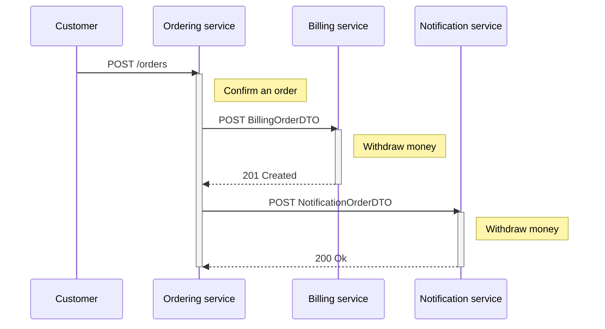

```mermaid
sequenceDiagram
    
    participant C  as Customer
    participant OS as Ordering service
    participant BS as Billing service
    participant NS as Notification service

    C ->> OS: POST /orders
    Activate OS
    Note right of OS: Confirm an order
    
    OS ->> BS: POST BillingOrderDTO
    Activate BS
    Note right of BS: Withdraw money
    BS -->> OS: 201 Created 
    Deactivate BS

    OS ->> NS: POST NotificationOrderDTO
    Activate NS
    Note right of NS: Withdraw money
    NS -->> OS: 200 Ok
    Deactivate NS
    
    Deactivate OS
```