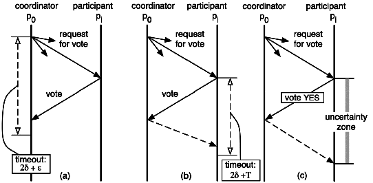

# Распределенные транзакции

## Используемый паттерн

Для реализации распределенной транзакции использовался паттерн "Трехфаный коммит".  
Отличие трехфазного коммита от двухфазного коммита в том, что он не является блокирующим алгоритмом, 
так как убирает неопределенность для resource менеджера в случае "падения" менеджера транзакций 
(TM - transaction manager) или диспетчера ресурсов (RM - resource manager).

### Двухфазный коммит (Two-phase commit, 2PC)
***
На основе http://lig-membres.imag.fr/krakowia/Files/MW-Book/Chapters/Transact/transact-body.html
***
**Принцип работы шаблона двухфазного коммита**  
Один из процессов выбирается в качестве **Координатора** (TM), который выполняет процесс "голосование" о готовности 
к коммиту resource менеджеров (RM). Каждый RM подтверждает готовность (Yes или No) отправляя сообщение TM.
Когда TM получает ответы от всех RM, TM принимает решение о коммите или прерывании операции (abort), 
и отправляет свое решение всем RM.
Каждый RM следуя полученному решению от TM либо выполняет коммит, либо abort и отправлет подтверждение выполнения 
операции TM.

Этот процесс представлен на схеме

Для обнаружения ошибок используется устанавливаемое время ожидания на roundtrip как показано на следующей схеме.

Если TM обнаруживает ошибку (RM не отвечает), то он должен принять решение Abort (рис.a).  
Если RM обнаруживает, что TM не активен (рис.b), то для начала RM пытается опросить другие RM, получали ли они решение.
Если другие RM получали решение, то RM, который выполняет опрос, следует этому решению. 
Если информация о решении не получена от других RM, то инициируется процесс выбора другого TM.

Когда TM или RM восстанавливаются после "падения", они используют log-записи для определения 
статуса транзакции и выполняют соответствующие действия.

Например:
1) Если транзакция в фазе 1, то TM начинает транзакцию заново;
2) Если транзакция в фазе 2, то TM сообщает всем RM о его решении взятом из лога;
3) Если транзакция уже зафиксирована (commited), то TM не выполняет ничего. 

RM после отправки утвердительного подтверждения о готовности к commit (YES) попадает в "зану неопределенности"
пока не получит решения о TM или пока не завершится устанавливаемый timeout (рис.c).
В этот промежуток времени другие RM уже могли выполнить commit или abort.
Например, RM1 ответил Yes, TM принял решение о commit и отправил его некоторым из RM (например RM2 и RM3, но не RM1).  
И после этого TM ошибочно завершился, следом ошибочно завершились RM2 и RM3, которые получили решение от TM.
Таким образом решение было принято, но RM1 его не получил 
и нет способа получить эту информацию до момента восстановления TM. 

Из-за такой потенциальной информации паттерн двухфазного коммита считается блокирующим, 
так как последующие транзакции не могут быть начаты до завершения текущей. 

### Трехфазный коммит (Three-phase commit, 3PC)

Трехфазный коммит называется Non-Blocking Commitment Protocol и предназначен для избежания блокировок.

Отличие от двухфазного коммита в добавлении еще одного промежуточного rountrip - "подготовка к коммит" (prepared to commit).

Избежание блокировок происходит благодаря этому дополнительному шагу "подготовка к коммит", которая уменьшает 
неопределенность RM о результате транзакции. 
После того как RM ответил Yes невозможна ситуация, когда любой другой RM зафиксировал транзакцию.
Другими словами в 2PC процесс TM знает, что все ответили Yes, а в 3PC процесс TM в добавок знает, что все RM знают,
что все RM ответили Yes, так как получили сообщение PREPARE.

## Сценарий

- Пользователь подтверждает заказ в сервисе заказов;
- При размещении заказа происходит снятие денег в сервисе биллинга;
- И происходит извещение пользователя о размещении заказа (подтверждение снятия денег не выполняется);

### Диаграмма классов

Примечание: на примере одного микросервиса billing-service

* TwoPCTransactionManagerService + BillingClientResource - реализуют функциональность transaction менеджера (TM).
* TwoPCTransactionManagerService + BillingServerResource - реализуют функциональность resource manager (RM).
* TwoPCTransactionManagerService управляет транзакциями TwoPCTransaction по паттерну трехфазного коммита.
* TwoPCTransaction - транзакция, которая может включать в себя один или много ресурсов TwoPCResource, 
  которые должны быть атомарно зафиксированы в разных микросервисах.
* BillingClientResource - клиент знающий протокол взаимодействия в микросервисом billing-service, используемый на стороне других микросервисов 
* BillingServerResource - реализация протокола взаимодействия в серверной части микросервиса billing-service

## Установка приложения
Установка приложения описана в файле [Setup and run.md](./Setup and run.md)